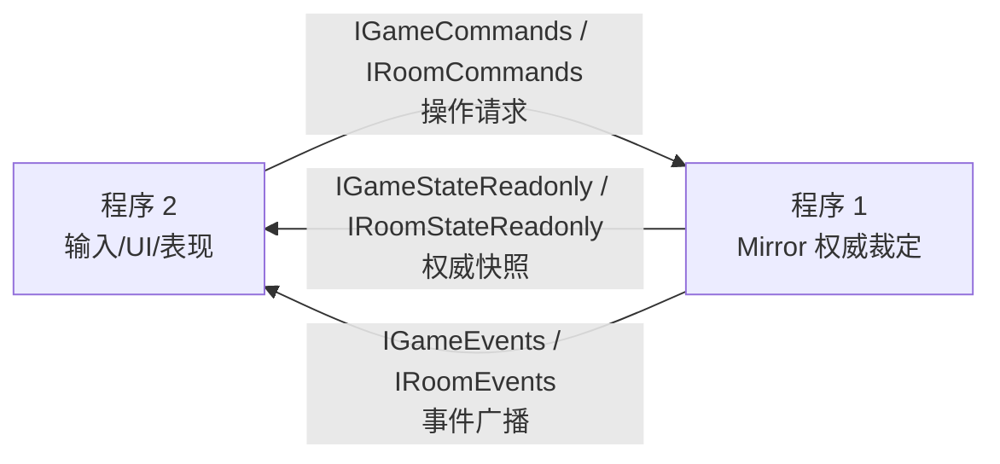
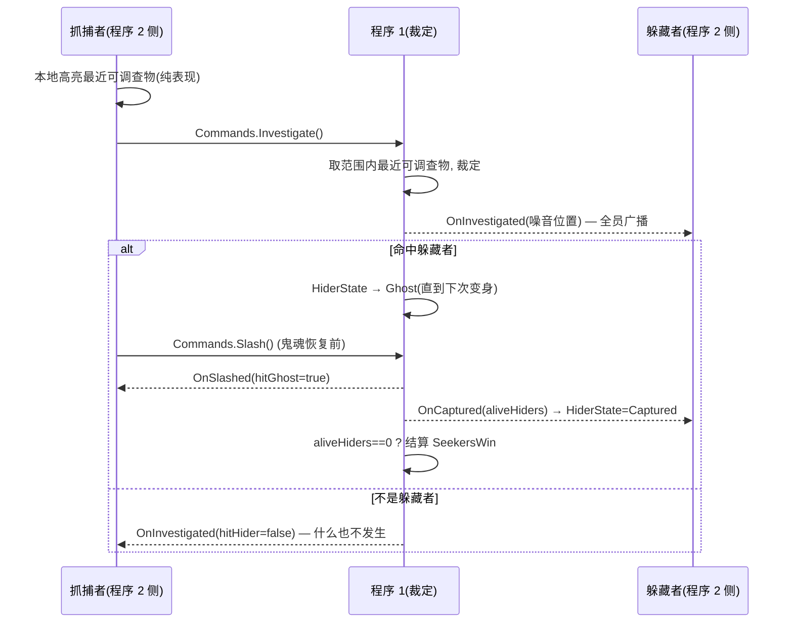

# 接口契约（程序 1 / 程序 2 分工）

> **分工定义**
>
> | 分工 | 负责范围 |
> |------|----------|
> | **程序 1** | 权威逻辑与联网：Mirror 同步、房间模块、身份名额、阶段状态机、放置/调查/劈砍/捕获的裁定、结算 |
> | **程序 2** | 操作与表现：角色操控手感、玩法表现（高亮/噪音/变身/心跳 VFX）、UI、音效与反馈 |
>
> 代码位置：`Assets/Scripts/Contract/`（6 个文件，双方共有）
>
> | 文件 | 内容 |
> |------|------|
> | `GameConstants.cs` | 全部数值常量（40/250/50/3、移速 0.3/0.5、心跳/探测圈 5 等）+ ID 无效值，唯一定义处 |
> | `GameEnums.cs` | `GamePhase` `PlayerRole` `HiderState` `PlaceFailReason` `GameResult` `GameCommandType` `RejectReason` `RoomConnectionState` `RoomStatus` `RoomOp` `RoomErrorReason` |
> | `GameDtos.cs` | 事件数据结构（`RoleSlots` `PlaceItemResult` `InvestigateInfo` `CommandRejected` `RespawnInfo` `RoomError` `RoomInfo` 等） |
> | `GameInterfaces.cs` | 对局：`IGameStateReadonly` / `IPlayerStateReadonly` / `IGameCommands` / `IGameEvents`；房间：`IRoomStateReadonly` / `IRoomCommands` / `IRoomEvents` |
> | `GameContract.cs` | 静态绑定入口（`Bind` / `BindRoom`，含空值检查），程序 2 一律经 `GameContract.*` 访问 |
> | `ItemTable.cs` | 共享物品表（ScriptableObject），资产在 `Assets/Data/ItemTable.asset`，itemId = 列表索引 |
>
> `Contract/` 自包含：`RoomStatus` 枚举已移入 `GameEnums.cs`；`RoomItemData` 是程序 1 房间发现层的内部数据，契约对外只暴露只读快照 `RoomInfo`。

---

## 0. 契约修改规则

**契约修改必须双方确认，并在同一次合并中同步更新 Network 和 Mock 两个实现**（给接口加成员会立即让未更新的实现编译失败，不存在「单方随时新增」）。枚举值不得重排或复用（只能在尾部追加新值）；DTO 字段不得单方面改变类型和含义。

## 1. 数据流向（唯一规则）

- **程序 2 永远不改游戏状态**，只发 `Commands`、读 `State`、订 `Events` 做表现
- **程序 1 做全部合法性校验**（阶段、名额、范围、顺序），程序 2 灰按钮只是体验优化
- 移动操作**不走契约**：躲藏者使用 AD 左右移动、空格跳跃、空格 + S 跳下；抓捕者使用 AD 左右移动且不可跳跃，只能在可互动楼梯处按 W 上下楼，空格用于劈砍。角色移动采用客户端权威（本地控制自己的角色，程序 1 只做同步与反作弊性校验）
- 队友视角**不走契约**：纯本地镜头行为，程序 2 从 `State.Players` 筛选存活躲藏者切换镜头

### 状态与事件的关系（两边实现必须遵守）

1. `State` 是最终权威快照；`Events` 只用于一次性表现，不承载状态
2. 程序 1 必须**先更新 State，再触发对应 Event**
3. 程序 2 初始化或重新绑定时**先读 State 兜底**，不能依赖曾经错过的事件
4. 所有事件在 Unity 主线程触发
5. 每个事件在接口注释中标明接收范围（全员 / 仅发起者），由 Network 实现负责区分投递（如 `OnPlaceResult`：成功 → 全员，失败 → 仅发起者）

### 命令的成功/失败反馈

命令都是异步 `void`（Mirror Command 无法同步返回裁定结果）：

- 成功：体现在 `State` 更新 + 对应事件（如选身份成功 → `OnRoleSlotsChanged` + `LocalPlayer.Role` 变化）
- 被拒绝：`OnCommandRejected(CommandRejected{ command, reason })`，**仅发给发起者**，覆盖身份已满/身份非法/不是房主/人数不足/阶段不允许/身份不允许/目标无效
- 例外：`PlaceItem()` 的成功与失败都走 `OnPlaceResult`（含更细的 `PlaceFailReason`，包括非躲藏者调用的 `WrongRole`），不走 `OnCommandRejected`

### ID 约定

| ID | 含义 | 无效值 |
|----|------|--------|
| `itemId` | 共享物品表 **ItemTable**（类在 `Contract/ItemTable.cs`，资产为 `Assets/Data/ItemTable.asset`，双方引用同一份）中的列表索引，从 0 起连续编号；条目只增不删不重排 | `GameConstants.InvalidItemId (-1)` |
| `netId` / `targetNetId` / `hiderNetId` / `seekerNetId` | Mirror `NetworkIdentity.netId` | `GameConstants.InvalidNetId (0)` |

约定：**所有可调查物体必须挂 `NetworkIdentity`**——放置出来的物品由 `NetworkServer.Spawn` 生成（自动有 netId）；场景预摆的可调查物挂 Scene NetworkIdentity。若后续预摆物数量导致网络开销问题，再由双方共同评估改为共享 `targetId` 编号表（属契约变更，走修改规则）。

## 2. 双实现，保证完全并行

| 实现 | 谁写 | 用途 |
|------|------|------|
| `NetworkGameState` + `NetworkRoomService`（Mirror） | 程序 1 | 真实联机 |
| `MockGameState` + `MockRoomService`（纯本地） | 程序 2 | 无网络跑完整流程：假计时、按键模拟命中 |

启动时各自调用 `GameContract.Bind(...)` / `GameContract.BindRoom(...)`。程序 2 全程对 Mock 开发，联调 = 换绑定，程序 2 的代码零改动。Mock 的时间轴必须用 `GameConstants` 里的同一套常数。

## 3. 功能 → 契约成员对照（以 PDF 和最新补充要求为准）

> 按键补充要求优先于 PDF：躲藏者空格跳跃、空格 + S 跳下；抓捕者不可跳跃，只能在可互动楼梯处按 W 上下楼。

### 基础功能

| 功能需求 | 契约成员 | 程序 1 职责 | 程序 2 职责 |
|----------|----------|-------------|-------------|
| 躲藏者移速 0.3 / 抓捕者 0.5 | `GameConstants.HiderMoveSpeed / SeekerMoveSpeed` | 校验异常速度（可选） | 控制器读常量 |
| 躲藏者：AD 左右移动、空格跳跃、空格 + S 跳下 | （不走契约，客户端权威） | 位置同步 | 先判断空格 + S 跳下条件，否则空格执行跳跃 |
| 抓捕者：AD 左右移动、不可跳跃、在可互动楼梯处按 W 上下楼 | （不走契约，客户端权威） | 位置同步 | 角色控制、楼梯交互与移动手感 |
| F 放置（仅准备阶段，空间不足提示） | `Commands.PlaceItem()` → `Events.OnPlaceResult` | 校验阶段/顺序/空间，生成物品 | 按键发起；失败弹 `PlaceFailReason` 提示；物品栏读 `LocalPlayer.ItemQueue` |
| F 调查 | `Commands.Investigate()` → `Events.OnInvestigated` | 选最近可调查物 + 裁定命中 | 按键发起；本地做**高亮**（纯表现，无需裁定） |
| 空格劈砍 | `Commands.Slash()` → `Events.OnSlashed / OnCaptured` | 裁定命中鬼魂 | 按键发起；播特效 |

### 机制

| 功能需求 | 契约成员 | 程序 1 职责 | 程序 2 职责 |
|----------|----------|-------------|-------------|
| 准备阶段：最大距离分散 + 40s + 按物品栏顺序放置 | `OnPhaseChanged(Prep, 40)`；`LocalPlayer.ItemQueue` | 分散出生点、计时、队列校验 | 物品栏 UI，倒计时读 `PhaseTimeLeft` |
| 每 50s 随机变身 + 隐身无敌 3s | `Events.OnHiderTransformed(TransformInfo)`（`invulnerableUntil` 为服务端时刻，抵抗延迟）；`HiderState.Invisible` | 定时触发、随机物品、无敌窗口 | 换外观 + 隐身 VFX，剩余时长 = `invulnerableUntil - NetworkTime.time`；**变身波期间抓捕者硬直 + 黑屏**（纯程序 2：复用 `invulnerableUntil`，锁定移动/调查/劈砍并遮蔽视野，非契约变更） |
| 抓捕者心跳（被动） | `Events.OnHeartbeatPulse(HeartbeatPulse)`（含 `serverTime` 对齐节拍）；半径 `GameConstants.HeartbeatRadius = 5`（= 探测圈） | 固定节奏广播 | **探测圈内**仅躲藏者放置的可调查物视觉节点跳动（不带动伪装躲藏者本体） |
| 探测圈（F 调查高亮） | `GameConstants.InvestigateRange = 5`（与心跳跳动半径一致） | 用同一常量裁定调查范围 | `SeekerRangeIndicator` 显示探测圈并高亮范围内最近可调查物（不因圈内有躲藏者变红） |
| 调查可视化警报 | `Events.OnInvestigated(InvestigateInfo)` | 广播调查结果（含 `seekerNetId` / `noisePosition`） | 存活躲藏者屏幕边缘朝猎人方向红光一闪（命中/未命中均触发） |
| 队友视角（低优先） | `State.Players` + `HiderState.Captured`（无命令，本地镜头） | 维护玩家列表与被捕状态 | 筛选存活躲藏者、切换镜头与 UI |
| 结算：250s 到时躲藏者胜 / 全灭抓捕者胜 | `Events.OnGameEnded(MatchResult)`；`State.AliveHiders` | 计时 + 存活统计 + 裁定 | 结算界面 |

### 抓捕流程（F + 空格 完整链）

### 房间模块（主菜单 ↔ 小队房间）

| 功能需求 | 契约成员 | 程序 1 职责 | 程序 2 职责 |
|----------|----------|-------------|-------------|
| 创建房间 | `RoomCommands.CreateRoom(name, maxPlayers)` | 建房、成为房主 | 主菜单按钮、最大人数选项、加载提示 |
| 加入房间 | `RoomCommands.RefreshRoomList()` / `JoinRoom(serverId)` → `RoomEvents.OnRoomListUpdated(RoomInfo 快照) / OnRoomError(reason 枚举)` | 房间发现与连接（`ManualDiscovery`），内部 `RoomItemData` 转 `RoomInfo` | 房间列表 UI、按 `RoomErrorReason` 弹提示 |
| 返回主菜单（含局内 ESC） | `RoomCommands.LeaveRoom()` + `RoomEvents.OnConnectionStateChanged` | 断连清理 | 切场景 |

### UI

| 功能需求 | 契约成员 | 说明 |
|----------|----------|------|
| 设置/音量条、ESC 菜单、退出桌面 | **程序 2 本地实现**，不进契约 | ESC 不暂停游戏，无需裁定 |
| 身份选择、满员灰掉 | `Commands.SelectRole()` + `State.Slots`（`SeekerFull/HiderFull`）+ `Events.OnRoleSlotsChanged`；拒绝走 `OnCommandRejected` | 程序 2 按 `Slots` 灰按钮，程序 1 仍校验 |
| 练习大厅（随意劈砍/无限复活放置） | `State.IsPracticeLobby`；复活广播 `Events.OnHiderRespawned(RespawnInfo)` | Waiting 阶段程序 1 放开校验 |
| 房主开始（≥1抓+≥1躲） | `Commands.HostStartGame()` + `RoleSlots.CanStart` + `State.IsLocalPlayerHost`；拒绝走 `OnCommandRejected` | 程序 2 按 `IsLocalPlayerHost && CanStart` 亮按钮 |
| 玩家名单 / 存活数 / 本人状态 | `State.Players` / `State.AliveHiders` / `State.LocalPlayer` | HUD 与房间界面全部从 State 读 |

## 4. 开发与合并规则

1. **目录隔离**：`Contract/` 与 `Data/RoomItemData.cs` 共有；程序 1 只改 `Network/` `Game/`；程序 2 只改 `UI/` 与角色/表现脚本。
2. **契约修改**：见「0. 契约修改规则」——双方确认 + 同一次合并同步改两个实现。
3. **校验只在程序 1**：程序 2 发现按钮该灰没灰是 UI bug，不是安全问题——程序 1 拒绝即可（`OnCommandRejected`）。
4. **联调顺序**（每项都是「换实现验一条链」）：
   房间创建/加入 → 选身份/开局 → 放置 → 调查/噪音 → 鬼魂/劈砍/捕获 → 变身/无敌 → 心跳 → 结算 → 队友视角
5. **验收标准**：任意一天，程序 2 能用 Mock 演示完整一局表现；程序 1 能用 Host + 日志跑完全部裁定。
